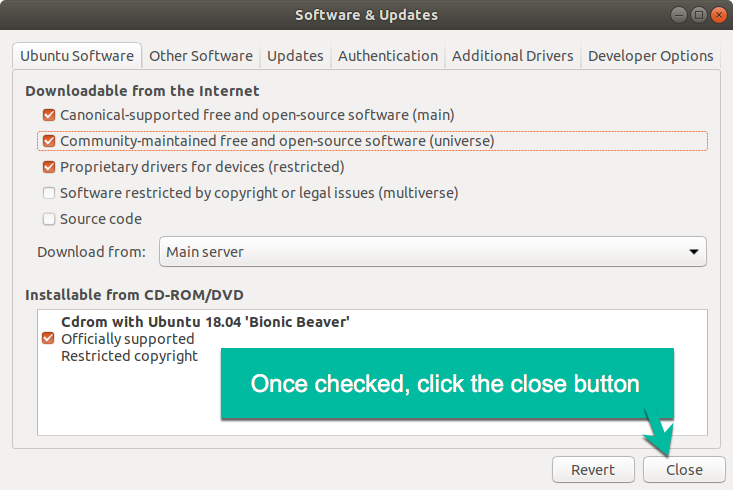

# Remove-Windows-Password-Using-Ubuntu-Linux-18

First off, I will not guarentee this will work. It took me about 25 minutes to figure this out by reading different articles. 

#### Articles Referenced
- https://www.lifewire.com/reset-windows-password-using-linux-2202068
- https://askubuntu.com/questions/932331/filesystem-shows-dev-nvme0n1p1-instead-of-dev-sda
- https://www.howtogeek.com/howto/14369/change-or-reset-windows-password-from-a-ubuntu-live-cd/
- https://opensource.com/article/18/3/how-reset-windows-password-linux


# How To

1. Create an Ubuntu Live (USB) or Disc
2. Boot from the Ubuntu Live(USB) / DISC and load Ubuntu 18

    > You will need to connect to the internet to download the packages.

3. Click on the 9 boxes in the bottom to display the available applications


4. In the search field begin to type: *Software* and click the ```Software & Up...```


5. This will open the ```Software Sources``` options.

6. Under the **Ubuntu Software** tab check: 
    
    - [x] ```Community-maintained Open Source software (universe)```


4. After checking the box, click the ```Close``` btn



5. When prompted click the ```Reload``` button


6. The packages will begin to download


7. Once the packages have downloaded. Close the ```Software & Updates``` window.

8. Next, open your terminal and type the command: 

    ```bash
    sudo apt-get install chntpw
    ```


9. After the install type the command:

    ```bash
    sudo mkdir /mnt/windows
    ```

10. Then type the command: 

    ```bash
    lsblk -f
    ```

11. This will show all the current disks.
12. Locate the disk with the most space, this will likely be your windows installation. 
13. The disks might be labelled like...

                NAME        FSTYPE          LABEL               UUID
        loop0       squashfs        
        sda
        |- sda1     ntfs            SYSTEM_DRV          A6HDKFHEH12B
        |- sda2     ntfs            Windows7_OS         KDLSKJ58LD0L
        nvme0
        |- nvme0n0  ntfs            Recovery            ...
        |- nvme0n1  ntfs            Windows10_OS          ...


13. In the next command after ```/dev/``` use the name that points to ```Windows```
14. Type the command:
    ```bash
    sudo ntfs-3g /dev/nvme0n1 /mnt/windows -o force
    ```

> This is what it all looks like in one window together.


15. Now type:
    ```bash
    ls /mnt/windows
    ```
    > This will list all the folders and files in the directory.


16. If you get a list of folders and files displayed on your screen, then everything is good to this point. Next change to the following direcetory using the command below:
    ```bash
    cd /mnt/windows/Windows/System32/config
    ```


17. Type:
    ```bash
    chntpw -l sam
    ```
    > To list all the Window's System Users that exist.


18. From the list generated. Replace the ```<username>``` with one the desired user.

19. Type:
    ```bash
    chntpw -u <username> SAM
    ```

    ```bash
    example:
        chntpw -u Administrator SAM
    ```


20. Next choose from the options available:


21. > If the account is not *enabled* or it is *locked*, I recommend you type the number ```2``` first and press enter. <br />
    > Otherwise, type the number ```1``` to clear the selected user's password. <br />
    > In this example that would be the *default Administrator*<br /><br />
    > Take a moment and look through the other menus. It's quite fun to know you could easily promote a user to administrator privileges or add/remove a user from the different groups. Have fun!

22. Once you are done, type ```q``` to quit and save your changes.


23. Type: ```exit``` to close the terminal or close it by click the (x)
24. Now in the top-right of the screen. Located that down-arrow. Click it and choose to restart your computer.


25. > Last, once the computer has restarted, login like you would normally.<br />
    > Now when you are prompted to input the credentials with Admin rights...<br />
    > <br />
    > If you are not on a network, then you can just type: ```Administrator``` and press enter.
    > <br /><br />
    > If you are on a network, then when you are prompted: type the name of the computer followed by a backslash and then Administrator. Then press enter, since you removed the password.

    example:

    ```MSNCMP01``` \\ ```Adminstrator```


*Note... If this helped you great! Otherwise, like I said at the beginning, there is no guarantee this will work for you.*